<div align="center">

# ☕ ClodKeyProxy

**Tray flyout key manager for Anthropic · Claude CLI + local Zoo Bridge**

Zero-install · zero-console-windows · zero dependencies

[](https://github.com/Apex4Coder/ClodKey/actions/workflows/ci.yml)
[](https://github.com/Apex4Coder/ClodKey/releases/latest)
[](#-quick-start)
[](#-why-this-stack)
[](#-zoo-bridge)
[](LICENSE)
[](app-next/strings.json)
[](https://linux.sb)

*One `.ps1` file for the UI. One `.mjs` file for the bridge. Both ship with nothing to install.*


</div>

---

## 🔁 What problem it solves

Some API stations — for example [agentrouter.org](https://agentrouter.org) — accept only
requests in the **Claude CLI format** (Anthropic Messages API as sent by `claude`).
Out of the box such a key works only in Claude CLI or in IDEs that speak the same format.

**ClodKey's Zoo Bridge is a relay that translates between the two worlds:**

```
Zoo Code / Roo Code  ⇄  Zoo Bridge 127.0.0.1:33110  ⇄  station that speaks Claude CLI format only
   (OpenAI-compatible)        (format relay)                 (e.g. agentrouter.org)
```

So a key that was usable only from Claude CLI becomes a regular provider inside
**Zoo Code (Roo Code)** in VS Code.

| Client | Status |
| --- | --- |
| Claude CLI (`claude`) | ✅ tested — profiles are applied directly to `~/.claude/settings.json` |
| Zoo Code / Roo Code | ✅ tested — through Zoo Bridge |
| Cline, Kilo Code, Continue, Cursor and other coding tools | ⚠️ **not tested** — may work if they speak an OpenAI-compatible API, no guarantees |

### 🟣 Opus watch

agentrouter.org turns the **Claude Opus family** on and off **on a schedule**.
The model check shows which models the station is serving *right now*, so you can see
the moment Opus goes live instead of burning requests on a model that is switched off.

> ClodKey is an independent tool, not affiliated with Anthropic or agentrouter.org.
> Use your keys in line with the terms of the station you use.

## ✨ What it does

Two **independent contours**, deliberately kept apart (see `SPEC.md`):

1. **Claude CLI** — profiles and writes only into `~/.claude/settings.json`.
2. **Zoo Bridge** — a separate window that manages the local OpenAI-compatible
   bridge from `app-next/bridge` on `127.0.0.1:33110`; the key and upstream live
   only in `app-next/bridge/.env`.

- 🫥 **Starts invisible.** Launched via WMI `CREATE_NO_WINDOW` + `FreeConsole()` —
  no console window ever exists (visible *or* hidden). Gate-tested: [`check-g22.ps1`](check-g22.ps1).
- 🎛 **Flyout from the tray.** Click the icon — a mini neumorphic panel slides up
  from the tray corner (eased slide + fade). Click again — it hides. `✕` = hide, never quit.
- 🔑 **Profiles of keys.** Base URL + API key (masked, 👁 reveal), auth mode
  (`ANTHROPIC_API_KEY` / `ANTHROPIC_AUTH_TOKEN` / both). The **System** profile is always
  first and locked; add / edit / delete your own with `+`.
- 🛡 **DPAPI at rest.** Keys encrypted with Windows DPAPI (CurrentUser) + entropy salt.
  The file is useless on another machine or under another user.
- 📥 **System import.** On startup it discovers existing `ANTHROPIC_*` env vars and
  `~/.claude/settings.json` and offers them as the "System" profile.
- 🚀 **One-click apply.** Writes the profile into the `env` block of
  `~/.claude/settings.json` (with `.clodkey.bak` backup). Restart `claude` — done.
- 🧭 **Bridge window.** A dedicated window with Start / Stop / Restart, a
  "load current profile" action and a one-line mini-log fed from the bridge
  `/status`. Closing the window only hides it — the listener on `33110` keeps running.
- 🌗 **Light / dark themes, 4 languages** (English by default) — micro icon buttons in the header
  (`Я A 文 Ñ` · `☀/☾` · `☕` · `✕`), persisted across restarts.
- ☕ **Coffee window** — QR code + Ethereum (ERC20) address with one-click copy.
- 🧩 **Extensions** — drop-in `app-next/ext/*.ps1` add-ons (badge, coffee window) loaded on start.
- 🎨 **Soft neumorphism** — tokens from canonical
  [themesberg/neumorphism-ui-bootstrap](https://github.com/themesberg/neumorphism-ui-bootstrap):
  raised = two soft offset shadows, pressed/input = inset. No borders, no gradients.

## 🚀 Quick start

```powershell
# 1. clone or download
git clone https://github.com/Apex4Coder/ClodKey
cd ClodKey

# 2. run (double-click works too) - no console, no window, just a tray icon
powershell -ExecutionPolicy Bypass -File deploy.ps1   # installs live\ and launches it
```

Or skip deploy: double-click `app-next\run-hidden.vbs`.

| File | What |
| --- | --- |
| `app-next\run-hidden.vbs` | launch with zero windows (WMI `CREATE_NO_WINDOW`) |
| `deploy-next.bat` | copy `app-next` → `live`, backup old, relaunch, verify alive |
| `check-g22.ps1` | gate: assert zero console windows owned by the app |
| `check-locales.ps1` | gate: every `T 'key'` in code exists in all 4 locales (no skew) |
| `verify-ui.ps1` | run `-Smoke` / `-SelfTest` / `-Shot` and tail the app log |
| `verify-deploy.ps1` | assert the tray app runs from `live\` and ports are sane |
| `smoke-health.ps1` | start the bridge on `33110`, poll `/health`, assert the degraded field is gone |

## 🧰 Why this stack

| Constraint | Choice |
| --- | --- |
| runs on *any* Windows machine | PowerShell 5.1 + WinForms — part of the OS, nothing to install |
| AV-safe, auditable | zero binary deps, single readable `.ps1` |
| no console flash ever | WMI `CREATE_NO_WINDOW` + `FreeConsole()` (DETACHED_PROCESS kills powershell on Win11 — measured) |
| secrets | DPAPI CurrentUser + entropy; ciphertext in `data\secrets.json` |
| bridge upstream key | `app-next\bridge\.env` (machine-local, **gitignored**); template is `.env.example` |
| state survives deploys | `data\` and `logs\` live **outside** the release (GOLD §1.2) |

## 🏗 Architecture

```
ClodKey/
├── app-next/                     # the app (source of truth)
│   ├── ClodKeyProxy.ps1          # UI + DPAPI + apply + selftest + shot + bridge window
│   ├── strings.json              # ru / en / zh / es (UI text = data, not code)
│   ├── ext/                      # drop-in add-ons: badge, coffee window, their strings
│   ├── run-hidden.vbs            # WMI hidden launch
│   ├── start-clodkey.bat
│   └── bridge/                   # Zoo Bridge (Node, dependency-free)
│       ├── server.mjs            # format relay: Zoo/Roo Code <-> Claude CLI-format upstream
│       ├── .env.example          # template - copy to .env (gitignored)
│       └── tools/                # unit transforms + local harnesses
├── tests/                        # deploy-lock regression suite (temp tree only)
├── SPEC.md                       # UI spec + cosmetic/UX defect registry
├── deploy.ps1                    # next -> live: stop own -> backup -> copy -> launch -> verify
├── check-g22.ps1                 # zero-console-window gate
├── check-locales.ps1             # locale key cross-check gate
├── verify-ui.ps1                 # UI build/behavior evidence
├── verify-deploy.ps1             # deploy state assertions
├── smoke-health.ps1              # bridge /health smoke test
└── .github/                      # CI, release, issue forms, PR template, security policy
```

Every tray action has a **CLI twin** (GOLD principle — clicks are untestable, commands are):

```powershell
powershell -STA -File app-next\ClodKeyProxy.ps1 -Smoke      # UI builds, DPAPI roundtrip
powershell -STA -File app-next\ClodKeyProxy.ps1 -SelfTest   # save/apply/import/lang/theme/layout asserts
powershell -STA -File app-next\ClodKeyProxy.ps1 -Shot       # renders logs\shot.png
```

## 🌉 Zoo Bridge

The bridge is a **separate node process**, started on demand from the Bridge window
(or by hand) and stopped independently. The UI never proxies traffic itself.

```powershell
cd app-next\bridge
copy .env.example .env      # then put your real UPSTREAM_API_KEY in .env
node server.mjs             # listens on 127.0.0.1:33110
```

In Zoo Code / Roo Code pick an **OpenAI-compatible** provider with base URL
`http://127.0.0.1:33110/v1`.

- **Ownership by path, not by port.** `deploy.ps1` stops only node processes whose
  working directory is our `bridge\`, so an unrelated bridge on another port is
  never touched (a real defect paid for this rule — see the header of `deploy.ps1`).
- **Disk hygiene.** `proxy.log` rotates by size (`LOG_MAX_BYTES` / `LOG_KEEP`) and
  `diag\` is pruned (`DIAG_MAX_FILES` / `DIAG_MAX_BYTES`); both are gitignored.
- **Context compaction.** `COMPACT_MODE=hybrid` keeps the conversation under budget
  instead of letting a single request blow past the upstream limit.

## 🧪 Invariants (each paid for by a real bug)

- `.ps1`/`.bat`/`.vbs` are **ASCII-only** (OEM codepage turns Cyrillic in code into garbage);
  UI text lives in UTF-8 `strings.json`.
- `Application::Run()` without a form argument; GUI process never `detached`.
- No silent defaults: unknown DPAPI format → empty + log, never a guess.
- Layout is **measured** (`Do-Layout`), not hardcoded pixels — fixed coords broke at DPI ≠ 100%.
- Missing locale key is a **gate failure**, not a blank label (`check-locales.ps1`).
- CI enforces all of the above on every push.

## ❓ FAQ

**Why is there no installer?** There is nothing to install. The app is one script
the OS already has a runtime for; the bridge is one dependency-free `.mjs` file
(the Node runtime is the only external requirement, and only for the bridge).

**Where are my keys?** Claude CLI keys live in `data\secrets.json`, DPAPI-encrypted
for *your* Windows user. The bridge upstream key lives in `app-next\bridge\.env`
(plaintext, machine-local, gitignored). Copy either to another machine and the
DPAPI file is unreadable by design.

**Does it work with Cline / Cursor / Continue?** Not tested. Only Claude CLI and
Zoo Code / Roo Code are verified.

**Can I run two instances?** No — single-instance mutex; the second one exits silently.

**Does closing the Bridge window stop the bridge?** No. Closing hides the window and
stops only its UI timer; the listener on `33110` keeps serving.

**The tray icon is hidden under the chevron?** Windows does that to all new icons.
Settings → Personalization → Taskbar → Other system tray icons → show ClodKey.

## ☕ Support

<div align="center">

<a href="https://etherscan.io/address/0x50153B5CC3eae905291d62602226C80896Aa64f2"></a>

```
0x50153B5CC3eae905291d62602226C80896Aa64f2
```

<sub>Ethereum (ERC20) only — ETH or ERC-20 tokens. Other networks = lost funds.</sub>

</div>

## 🤝 Contributing

Read [CONTRIBUTING.md](CONTRIBUTING.md) — the GOLD invariants are the contract.
Bugs & ideas: [issue forms](../../issues/new/choose). Security: [SECURITY.md](SECURITY.md).

## 📄 License

[MIT](LICENSE)
